# README: Project 4 – Simple Router

**Student ID:** 2021-18641  
**Name:** Hadong Lee  

---

| Test ID | Command | Description |
|---------|---------|-------------|
| **T1** | `client1 ping 192.168.2.2` | Tests basic ARP broadcast/reply exchange and ICMP Echo Reply generation. Confirms that the router responds to echo requests directed to its interface and properly resets TTL. |
| **T2** | `client1 traceroute 192.168.2.2` | Verifies TTL decrement at each hop and correct generation of ICMP Time Exceeded messages from the router during intermediate forwarding. |
| **T3** | `client1 ping 8.8.8.8` | Tests behavior when destination is unreachable due to no matching route in the routing table. Router must respond with ICMP Network Unreachable. |
| **T4** | `client1 ping 192.168.2.99` | Ensures ARP retry logic is triggered and fails after 5 attempts, followed by correct generation of ICMP Host Unreachable. |
| **T5** | `client1 wget 10.0.1.1` | Sends UDP to a closed port on the router to test generation of ICMP Port Unreachable when transport protocol reaches an unsupported endpoint. |
| **T6** | `client2 ping 10.0.1.100` | Tests enforcement of IP blacklist policy for source IPs within 10.0.2.0/24. Packet should be dropped silently with router's logs. |
| **T7** | `client1 ping 10.0.2.100` | Tests enforcement of IP blacklist policy for destination IPs within 10.0.2.0/24. Packet should be dropped silently with router's logs. |

## Test 1 result
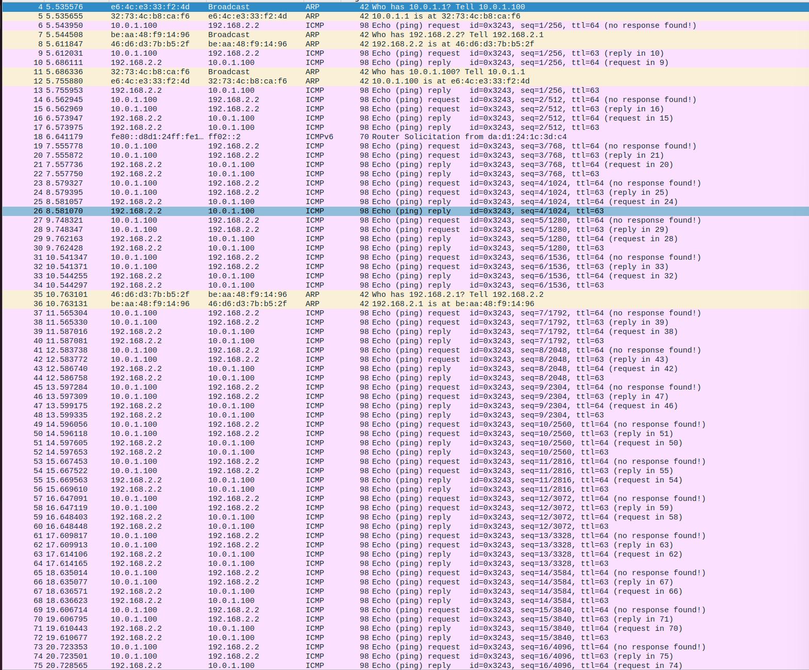
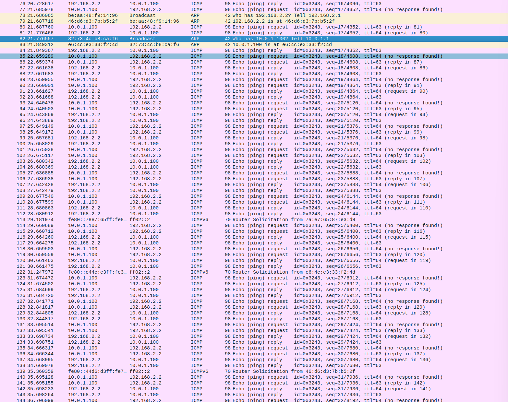
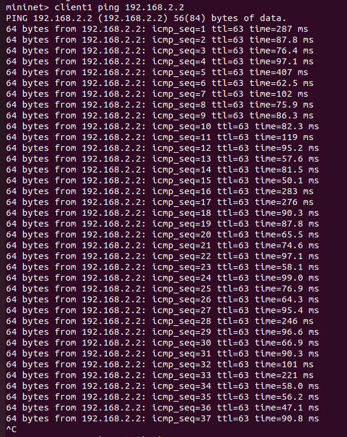

## Test 2 result
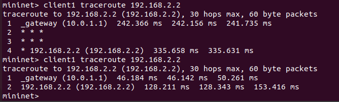
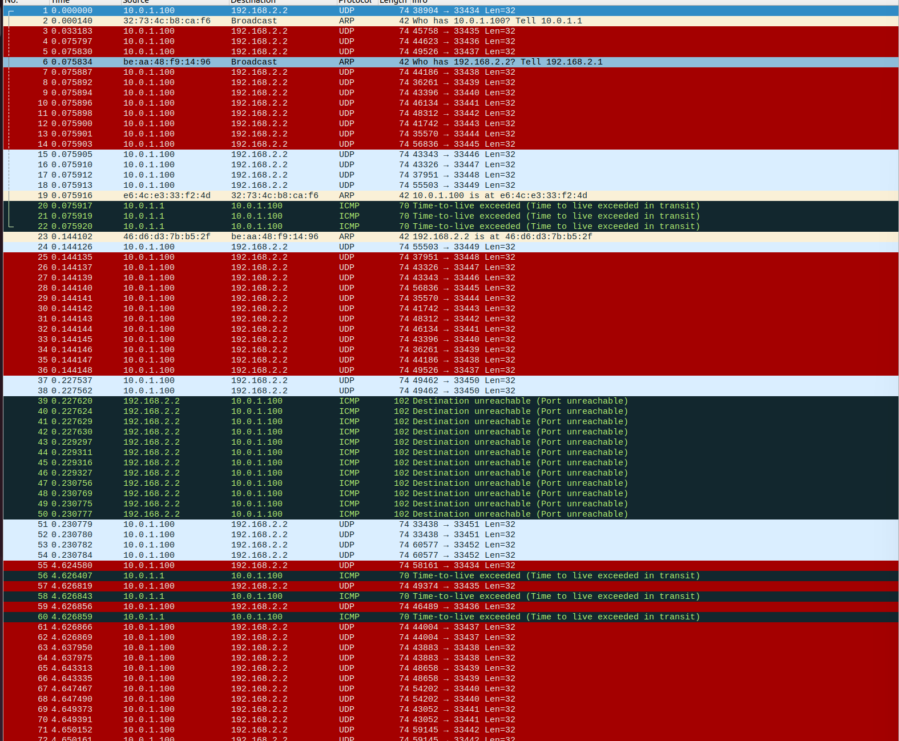
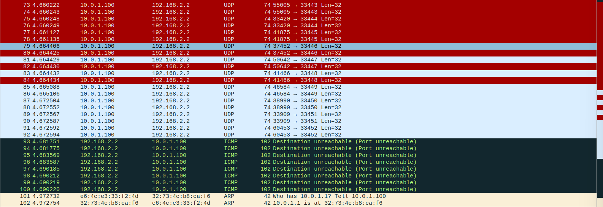

## Test 3 result
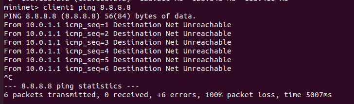
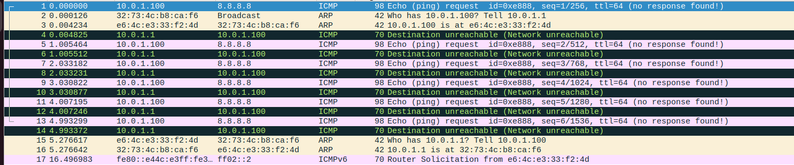

## Test 4 result
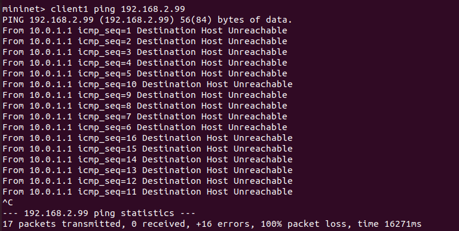
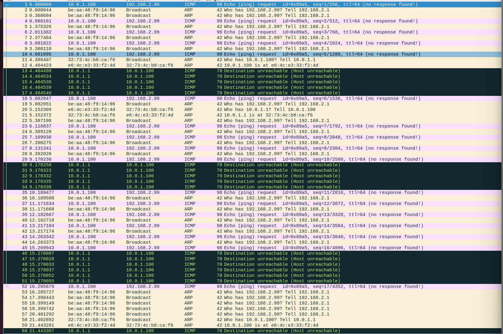

## Test 5 result
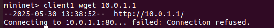
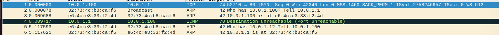

## Test 6 result

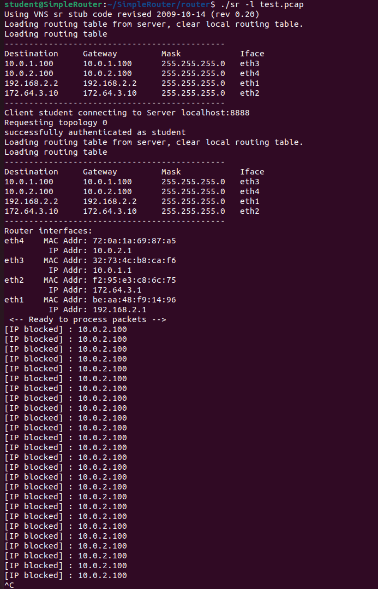
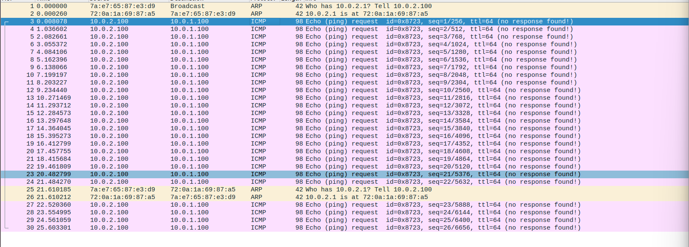

## Test 7 result
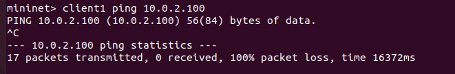
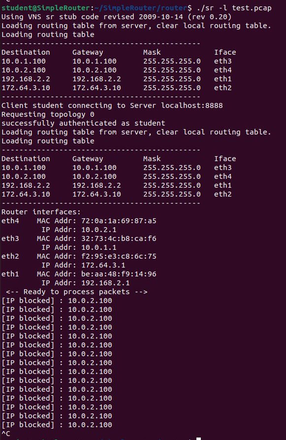

## Inital TTL
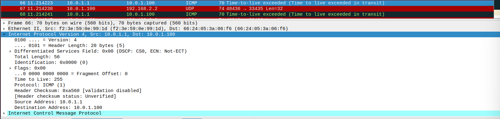
